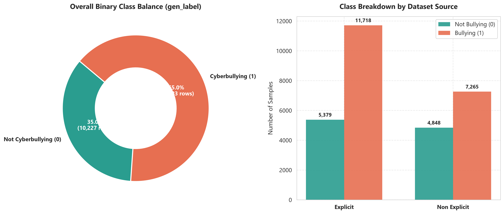
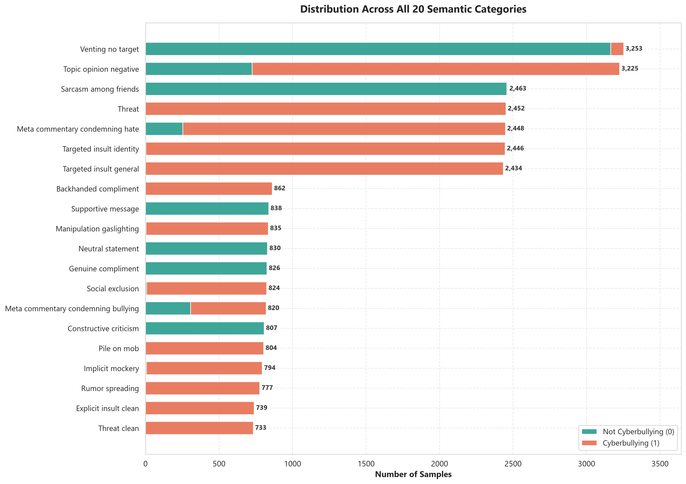
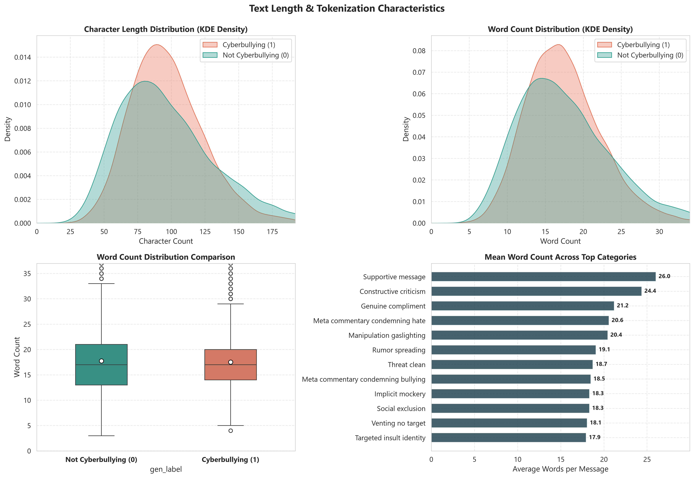
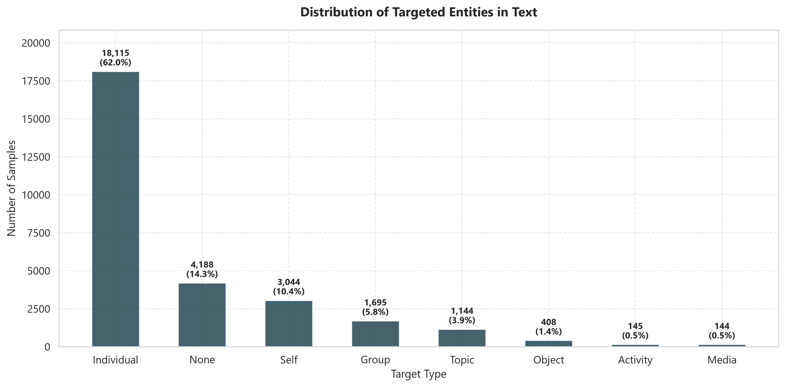

# Dataset Profile

## Source snapshot

The repository's analytics summary describes 29,210 rows across 20 categories. It records 18,983 positive (`gen_label = 1`) and 10,227 negative (`gen_label = 0`) rows, or 64.99% and 35.01%, respectively. The source mix is 17,097 explicit and 12,113 non-explicit rows. These are source-snapshot statistics, before the training script's preparation and split.

The summary lists mean text length of 97.3 characters and 17.6 whitespace-separated words; the reported 95th percentiles are 154 characters and 28 words. The largest listed values are 317 characters and 58 words.

## Model-ready split snapshot

The saved CSV splits contain 29,020 rows in total: 23,216 training, 2,902 validation, and 2,902 test rows. The difference from the 29,210-row analytics snapshot is 190 rows. The repository records cleaning, placeholder filtering, and duplicate handling in the training pipeline, but the saved artifacts do not provide a row-by-row reconciliation for this difference; do not assign it to one cause without further analysis.

The saved validation and test CSVs each contain 1,545 class-0 and 1,357 class-1 rows. Training contains 12,358 class-0 and 10,858 class-1 rows. These split counts use the pipeline's final `label` column, which is category-derived by default; they are not necessarily the original `gen_label` counts.

## Category profile

There are 20 categories, ranging from hard negatives such as `venting_no_target`, `topic_opinion_negative`, and `meta_commentary_condemning_hate` to positive categories such as `targeted_insult_general`, `social_exclusion`, and `rumor_spreading`. See the full [label mapping](label_schema.md) and copied [dataset statistics JSON](assets/json/dataset/summary_statistics.json).

Additional figures: [word frequencies](assets/images/dataset/03_word_frequency_unigrams.png), [bigram frequencies](assets/images/dataset/04_word_frequency_bigrams.png), and [augmentation analysis](assets/images/dataset/06_augmentation_analysis.png).