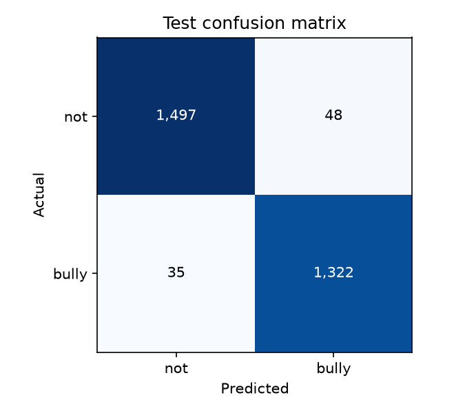

# Held-Out Evaluation

## Primary saved report

The training pipeline selects the threshold on validation data by maximizing validation macro-F1 on a grid from `0.05` through `0.95`, then evaluates the selected checkpoint on the test split. The saved configuration threshold is `0.23`.

| Test operating point | Threshold | Accuracy | Macro-F1 | Bullying precision | Bullying recall | ROC-AUC | PR-AUC |
|---|---:|---:|---:|---:|---:|---:|---:|
| Validation-selected | 0.23 | 0.9714 | 0.9713 | 0.9650 | 0.9742 | 0.9964 | 0.9958 |
| Fixed threshold | 0.50 | 0.9728 | 0.9727 | 0.9740 | 0.9676 | 0.9964 | 0.9958 |

The validation-selected operating point has confusion matrix `[[1497, 48], [35, 1322]]`, ordered as `[[TN, FP], [FN, TP]]`. The fixed `0.50` point has `[[1510, 35], [44, 1313]]`. The test set contains 2,902 rows. These values come from the training run's [metrics JSON](assets/json/training_run/metrics.json).

## Separate evaluator output

The independent evaluation script writes a second report, copied [here](assets/json/independent_evaluation/pytorch_best_model_metrics.json). It sweeps thresholds using the CSV passed as `--data`; in the saved output that file is the held-out `test.csv`. Consequently its "best macro-F1 threshold" (`0.35`) is selected using test labels. Treat that threshold-specific score as exploratory, not as an unbiased final test estimate. The same output's threshold-free ROC-AUC and PR-AUC can be reported as metrics calculated from test probabilities, but distinguish this artifact from the training run's validation-selected report.

The evaluator-generated [ROC curve](assets/images/model/pytorch_best_model_roc_curve.png), [precision-recall curve](assets/images/model/pytorch_best_model_pr_auc_curve.png), [threshold sweep](assets/images/model/pytorch_best_model_accuracy_vs_threshold.png), [default-threshold confusion matrix](assets/images/model/pytorch_best_model_confusion_matrix_default.png), [test-selected-threshold confusion matrix](assets/images/model/pytorch_best_model_confusion_matrix_best_macro_f1.png), and [calibration curve](assets/images/model/pytorch_best_model_calibration_curve.png) are retained as diagnostics. The threshold plots and test-selected matrix must be described with the selection caveat above.