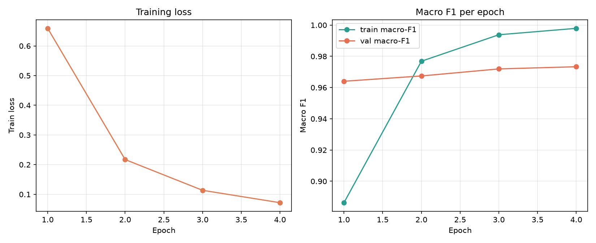

# Model and Training Setup

## Architecture

The saved run uses the pretrained `distilbert-base-uncased` encoder, attention-mask-weighted mean pooling, dropout (`0.1`), a two-class binary head, and a 20-class category head. The objective combines weighted binary cross-entropy with `0.3` times category cross-entropy. The category head is auxiliary to the binary detection task.

## Saved run configuration

| Setting | Saved value |
|---|---:|
| Maximum token length | 128 |
| Batch size | 16 |
| Epochs completed | 4 |
| Learning rate | `2e-5` |
| Warmup ratio | 0.10 |
| Weight decay | 0.01 |
| Early-stopping patience | 2 |
| Auxiliary category loss weight | 0.30 |
| Random seed | 42 |
| Label source | Category mapping |
| Validation-selected threshold | 0.27 |

Binary class weights were computed from training data and saved as approximately `[1.0074, 0.9927]` for labels 0 and 1. The code uses AdamW, gradient clipping at norm 1.0, and a linear warmup/decay schedule. See the copied [run configuration](assets/json/training_run/run_config.json) and [training metrics](assets/json/training_run/metrics.json).

## What this does not show

Only this configuration's saved result is documented here. The repository does not provide a controlled comparison establishing that DistilBERT, the auxiliary head, class weighting, or these hyperparameters outperform alternatives. Model-selection rationale in older notes is not experimental evidence. No model was retrained as part of preparing this dossier.