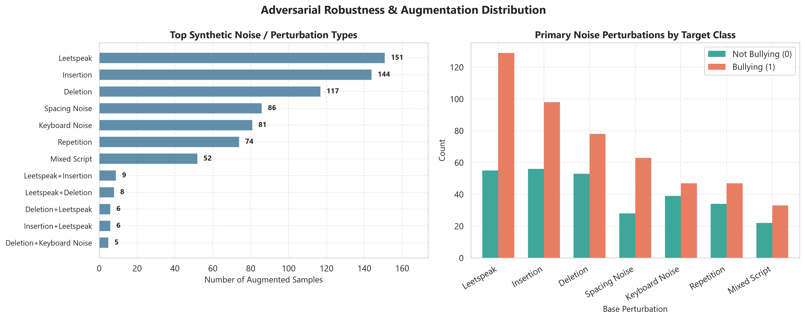

# Robustness and Error Analysis

## Saved robustness measurements

The training run reports accuracy `0.9487` on 78 augmented test rows. It also reports clean accuracy `0.9720`, accuracy `0.9394` on programmatically perturbed clean test text, clean macro-F1 `0.9719`, perturbed macro-F1 `0.9392`, and prediction flip rate `0.0510`.

The training code constructs perturbations using leetspeak substitutions, character deletion/insertion, neighboring-key substitutions, and inserted spacing. These are results for the implemented synthetic transformations only; they do not establish robustness to all evasion strategies or naturally occurring language variation.

## Interpretation limits

The 78-row augmented subset is small. The saved report does not provide confidence intervals or significance tests for these robustness values. The perturbation routine is synthetic and shares assumptions with the training pipeline. Avoid describing the model as "robust" without this qualification.

No per-category error table is summarized here because the research claim should be based on inspecting the corresponding [`per_category_errors.csv`](../cyberbully_v0.1_run/per_category_errors.csv), including its category-level denominators. Treat that artifact as exploratory until those counts and label definitions are reviewed.